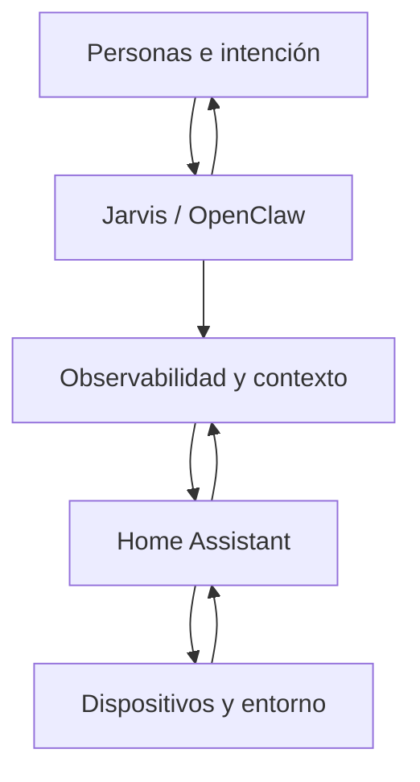

# Arquitectura del hogar colaborativo

La arquitectura combina automatización local, procesamiento en el borde y razonamiento asistido. No busca concentrar todo en un único componente: cada capa conserva una responsabilidad clara.

## Capas

### Entorno físico

Luces, sensores de presencia, cámaras, climatización, medidores de energía, dispositivos multimedia, actuadores Zigbee, Wi-Fi e infrarrojos.

### Ejecución y estado

**Home Assistant** mantiene el modelo operativo: entidades, automatizaciones, scripts, helpers, dashboards e historial. Es la autoridad de ejecución del hogar.

### Servicios especializados

- **Frigate + Coral:** detección visual local.
- **go2rtc:** distribución eficiente de video.
- **MQTT:** transporte de eventos y estados.
- **MariaDB:** persistencia histórica.
- **Node-RED:** flujos complementarios.
- **AdGuard Home y OpenWrt:** visibilidad y control de red.
- **STT/TTS y modelos de conversación:** interacción por voz.

### Observabilidad

Los paquetes de observabilidad transforman métricas dispersas en señales operativas: salud general, riesgo térmico, presión de carga, entidades no disponibles y posibles ofensores.

Una métrica aislada describe un valor. Un modelo de observabilidad cuenta una situación.

### Agencia

**OpenClaw** proporciona a Jarvis un espacio de trabajo y herramientas. Jarvis no sustituye las reglas deterministas de Home Assistant; investiga, compara, documenta y realiza intervenciones acotadas cuando existe autorización.

## Flujo operativo

Toda intervención relevante sigue este ciclo:

1. **Observar:** comprender el objetivo y el estado visible.
2. **Inspeccionar:** localizar fuentes, dependencias y restricciones.
3. **Planificar:** elegir el cambio mínimo capaz de producir evidencia.
4. **Respaldar:** preservar un punto de retorno fechado.
5. **Modificar:** aplicar la intervención en un alcance controlado.
6. **Validar:** comprobar estructura, sintaxis y referencias.
7. **Recargar:** ejecutar solo el reinicio o reload necesario.
8. **Verificar:** observar el comportamiento real.
9. **Reportar:** explicar decisiones, descartes, límites y próximos pasos.

## Distribución de autoridad

| Actor | Responsabilidad |
|---|---|
| Personas | Intención, límites, prioridades y aceptación final |
| Jarvis | Investigación, propuesta, intervención reversible y reporte |
| Home Assistant | Estado, automatización y ejecución determinista |
| Observabilidad | Evidencia sobre salud y comportamiento |
| Dispositivos | Acción y percepción sobre el mundo físico |

La autonomía no se mide por cuántas cosas puede cambiar un agente. Se mide por cuántas decisiones correctas puede tomar sin romper la confianza.
